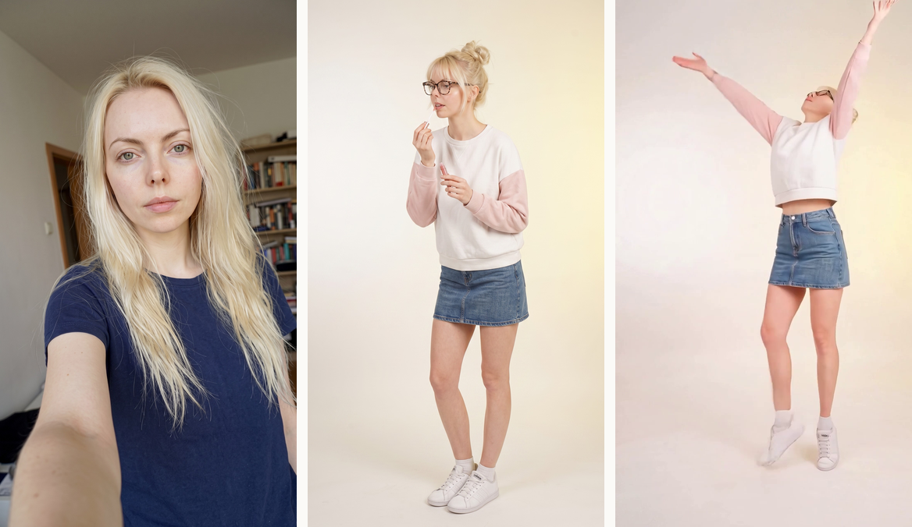
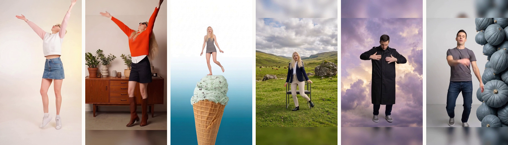

# Липсинк-шаблоны

Пользователь грузит обычное селфи и выбирает шаблон. На выходе — вертикальный
ролик со звуком, где в кадре он сам.



<sub>Слева направо: фото клиента · эстетика шаблона · кадр готового ролика.</sub>

---

Это два предмета, а не один.

**Пайплайн генерации** — восемь ступеней от селфи до готового ролика. Семь
бесплатны и стоят до платной, чтобы брак ловился на картинке за доли цента, а
не на видео за доллар.

**Прибор для сборки шаблонов** — составитель пишет промт, подаёт демо-личность
и получает эстетику, готовую к продаже. Новый шаблон рождается за прогон, а не
за спринт.



<sub>Шесть шаблонов первого батча. Одна личность, шесть эстетик, четыре разных
драйвинга.</sub>

---

## Числа

| | |
|---|---|
| `$0.70` | ролик 10 секунд; ставка `$0.07/с` подтверждена четырьмя замерами счёта |
| `720×1280` | ровно 9:16 на выходе модели, обрезка в сборке — 0% площади |
| `300 кадров` | ровно 10.0 секунды у всех шести, без разброса |
| `0 резов` | монтажных швов в кадре, у всех шести |

---

## Как устроено

```
1  приём драйвинга        склейки, длина сцены, окно        бесплатно
2  эстетика               промт + демо-личность              центы
3  приёмка эстетики       демо-личность на месте             бесплатно
4  сборка рефки           фото клиента + эстетика            центы
5  приёмка рефки          утечка, план, композиция           бесплатно
6  генерация видео        Kling Motion Control               $0.07/с
7  сборка                 9:16, звук, длина                  бесплатно
8  приёмка ролика         глазами                            бесплатно
```

Каждая проверка отвечает одним из **трёх** исходов — `годно`, `не годно`,
`не смогли проверить` — и третий не сворачивается ни в первый, ни во второй.
Рядом с вердиктом всегда числа: проверено N, нарушений M, не смогли K.

Ноль нарушений при нуле проверок — не успех, и код это печатает буквально.

## Как встроить

Логика конвейера не зависит ни от бэкенда, ни от модели.

Каждый вызов наружу — параметр, а не жёсткая ссылка: подменяются модель,
хранилище, очередь. Поэтому тесты прогоняют весь путь, не касаясь сети.

Слой приёмки не знает, кто сгенерировал вход. Его можно поставить перед любым
существующим пайплайном как отдельный контроль качества.

Смена видеомодели — это один вызов. Ограничения Kling (минимум три секунды,
нестабильная покадровая выдача) — свойства модели, а не подхода: снимаются
переходом на другую по API или на опенсорс на своих GPU.

## Требования к драйвингу

Единственный вход, который не рисуется, а покупается. Поэтому требования к нему
вынесены отдельно — это чек-лист закупки, а не настройка.

- **Лицо крупнее 100 px.** Ниже этого личность нечем измерять, и модель
  переносит её неуверенно. Измерено: драйвинги с лицом 34–56 px дали плывущее
  лицо, с 85–139 px — удержали.
- **Одна сцена, ноль монтажных склеек.** Шов внутри окна даёт смену плана в
  готовом ролике.
- **Сцена длиннее продуктовой длины.** Окно режется из середины самой длинной
  сцены равными полями.
- **Человек не уходит за край.** Композиция драйвинга переносится в промт
  эстетики: модель кладёт позу с видео.

Липсинк — самый тяжёлый материал, и особенно тот, где персонаж
**разворачивается**: на развороте лицо уходит из кадра целиком.

## Тесты

```
python -m unittest discover -s ball_reel/tests -p "test_fork_*.py"
```

Больше четырёхсот сторожей. Каждый сторожит найденный дефект, а не строчку
кода, и говорит в докстринге, какой именно. Пороги мутируются в обе стороны:
если планка ничего не сторожит, тест не покраснеет.

## Лицензия

Исходники открыты для чтения и проверки, но это **не** open source:
использовать, копировать и встраивать нельзя без договорённости. Подробности —
[LICENSE](LICENSE).

Отдельно: часть измерительных компонентов, использованных при разработке,
лицензирована только для некоммерческого применения. Это учтено и описано в
документах.
